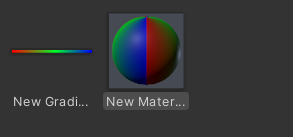

# UnityGradientTextureAsset
Unity : create simple gradient texture asset

### Setup
> Untiy > 2019.1
1. Copy `GradientTextureAsset` folder to your project's assets folder.
2. Done

### How-to
 
- 
 
- 

- 
- use it like texture  